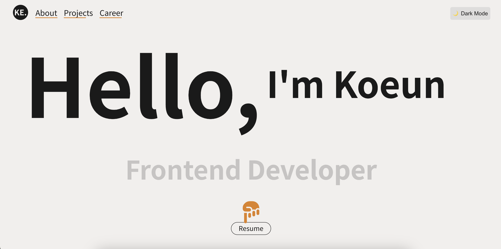

# Portfolio Website

## K-Ke Portfolio

개인 포트폴리오 웹사이트입니다. React를 기반으로 제작되었으며, 반응형 디자인과 다양한 인터랙티브 요소를 포함하고 있습니다.

## 📸 스크린샷

### 라이트 모드

### 다크 모드

## 🚀 주요 기능

- **다크 모드**: 사용자 선호도에 따른 테마 전환 기능
- **스크롤 애니메이션**: GSAP를 활용한 부드러운 스크롤 인터랙션
- **반응형 디자인**: 모든 디바이스에서 최적화된 레이아웃
- **타이핑 효과**: 동적인 텍스트 표시 애니메이션
- **갤럽 강점 분석**: 인터랙티브한 강점 설명 UI

## 🛠 기술 스택

- **Frontend**: React
- **Animation**: GSAP
- **Styling**: CSS
- **Version Control**: Git

## 📦 주요 라이브러리

- `gsap`: 스크롤 기반 애니메이션 구현
- `react-router-dom`: 페이지 라우팅
- 기타 사용된 주요 라이브러리...

## 🎨 디자인 특징

- 미니멀한 UI/UX
- 다크/라이트 모드 지원
- 모던한 타이포그래피
- 부드러운 전환 효과

## 🎨 스타일링 특징

- CSS 변수 기반 테마 관리
- 모바일 퍼스트 반응형 디자인
- 다크모드/라이트모드 지원
- 부드러운 전환 효과

## 📱 지원 환경

- 모던 브라우저 (Chrome, Firefox, Safari, Edge 최신 버전)
- 반응형 디자인 (모바일, 태블릿, 데스크톱)

## 🔜 향후 계획

- [ ] 성능 최적화 및 코드 분할
- [ ] 추가 인터랙션 요소 구현
- [ ] 웹 접근성 개선
- [ ] 다국어 지원 추가

## 📝 라이선스

이 프로젝트는 MIT 라이선스 하에 있습니다.

## 👤 제작자

- 이름: 김고은 Kim Koeun
- 이메일: hing9ugii@gmail.com
- 웹사이트: https://k-ke-portfolio.netlify.app
